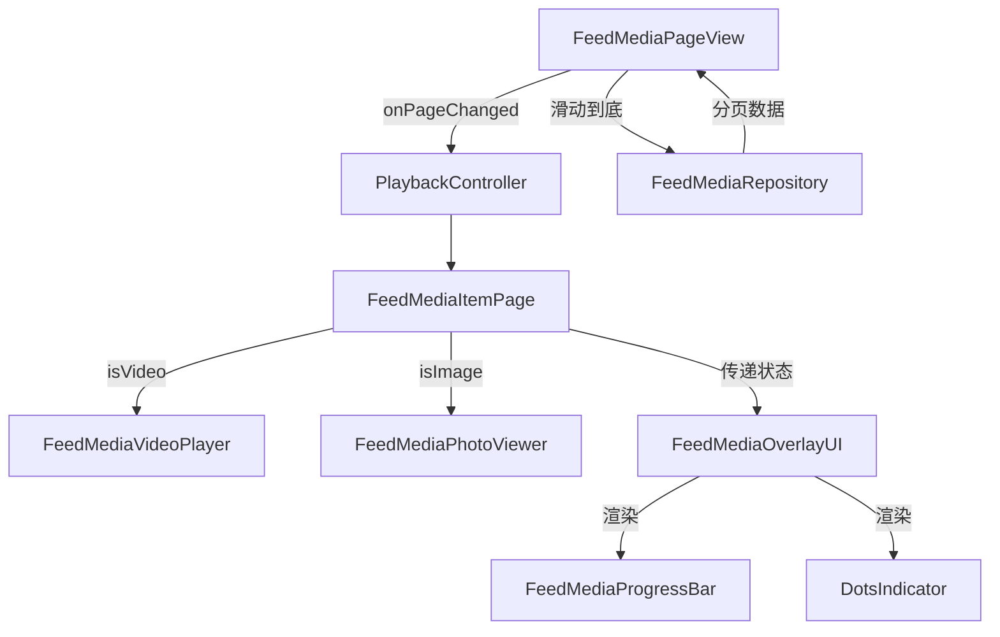

# 🛠️ Flutter FeedMedia 技术架构文档

## 一、整体技术栈

| 功能模块       | 技术选型                             |
|----------------|------------------------------------|
| 视频播放       | `better_player`                    |
| 图片浏览       | `photo_view` + `cached_network_image` + `carousel_slider` + `dots_indicator` |
| 状态管理       | `Riverpod`                         |
| 页面切换       | `PageView.builder` + `PageController` |
| 数据加载       | 自定义分页加载 + 网络层封装         |
| 视频预加载（进阶） | 自定义预加载队列逻辑                 |
| 进度条         | `Slider`                           |

---

## 二、模块划分

### 1. FeedMediaPageView（滑动容器）
- 使用 `PageView.builder` 构建上下滑动流  
- 配合 `PageController` 监听滑动  
- 控制前后页保活与视频状态切换  
- 通过 `Riverpod` 管理媒体数据加载和页面状态  

### 2. FeedMediaItemPage（内容卡片）
- 作为单个媒体项的容器，判断内容类型为视频或图片  
- **现在是媒体项的中央状态管理器，负责管理 `_currentImageIndex`，并将 `betterPlayerController` 和 `showProgressBar` 等状态传递给 `FeedMediaOverlayUI`。**
- **负责全屏点击手势的捕获，实现视频播放/暂停和长按功能菜单的触发。**

### 3. FeedMediaVideoPlayer
- 封装 `better_player`，不显示默认控件  
- 接收 `isActive` 控制播放状态  
- 生命周期内销毁 / 重建播放器资源  
- 暴露 `BetterPlayerController` 供外部监听和控制  

### 4. FeedMediaPhotoViewer
- **纯粹的、无状态的图片轮播组件，不再包含指示器逻辑，通过 `onPageChanged` 回调将页面索引传递给父组件。**
- 使用 `carousel_slider` 实现多图左右滑动  
- 搭配 `cached_network_image` 进行本地缓存  
- 禁用手势放大缩小  

### 5. FeedMediaOverlayUI
- **现在是所有底部浮层UI元素的统一管理中心，包括图片指示器和视频播放进度条。它接收来自 `FeedMediaItemPage` 的相关数据，并在内部进行布局。**
- 负责显示视频标题、描述、话题、点赞/评论/分享按钮和音量指示器。

### 6. FeedMediaProgressBar
- **其内部使用 `Slider` 实现手势拖动，并根据 `_isDragging` 状态动态调整 `trackHeight`。**

### 7. PlaybackController
- 提供全局播放状态管理：当前播放索引  
- 由 PageView 通知当前播放页索引  

### 8. FeedMediaRepository
- 管理网络请求，返回分页内容列表  
- 封装 APIClient 支持分页 & 错误处理  
- 提供模拟数据，包含 `id`, `type`, `url`, `title`, `description`, `topics`, `imageUrls` 等字段  

---

## 三、数据流架构



---

## 四、性能优化

- 使用 `AutomaticKeepAliveClientMixin` 保留页面状态  
- 控制同时播放视频数 ≤ 1（只播放当前页）  
- 销毁非当前页播放器，释放资源  
- 预加载前后两页（进阶）  
- 图片开启缓存，支持占位图与加载失败重试  
- **自定义进度条**: 使用 Flutter `Slider` 结合 `better_player` 的事件监听，避免了对 `better_player` 内部组件的依赖，提供了更灵活的UI控制和性能优化空间。**`Slider` 的 `onChanged` 回调仅更新视觉位置，`onChangeEnd` 回调才执行 `seekTo()` 操作，以实现流畅拖动。**
- **布局抖动**: **`Visibility` Widget 的 `maintainSize`、`maintainAnimation` 和 `maintainState` 属性用于确保 Widget 在不可见时仍占据空间，从而消除布局抖动。**

---

## 五、Native 能力扩展（可选）

| 功能         | 实现方式                        |
|--------------|--------------------------------|
| 自定义播放器引擎 | Flutter ↔ Native `ijkPlayer`     |
| 后台播放     | iOS / Android 平台能力集成        |
| GPU 滤镜效果 | Flutter Texture + 原生编解码       |

---

## 六、异常处理

- 视频播放失败：展示封面 & 提示  
- 网络错误：展示重试按钮  
- 滑动中断：捕获边界索引或网络未加载逻辑  

---

## 七、依赖包

```yaml
dependencies:
  flutter:
    sdk: flutter
  better_player: ^0.0.85
  photo_view: ^0.14.0
  cached_network_image: ^3.3.1
  flutter_riverpod: ^2.5.1
  carousel_slider: ^latest_version # 用于多图滑动
  dots_indicator: ^latest_version # 用于动画指示器
```

---

## 八、平台兼容性

| 模块     | Android | iOS |
|----------|---------|-----|
| 视频播放 | ✅       | ✅   |
| 图片浏览 | ✅       | ✅   |
| 滑动容器 | ✅       | ✅   |
| 状态管理 | ✅       | ✅   |