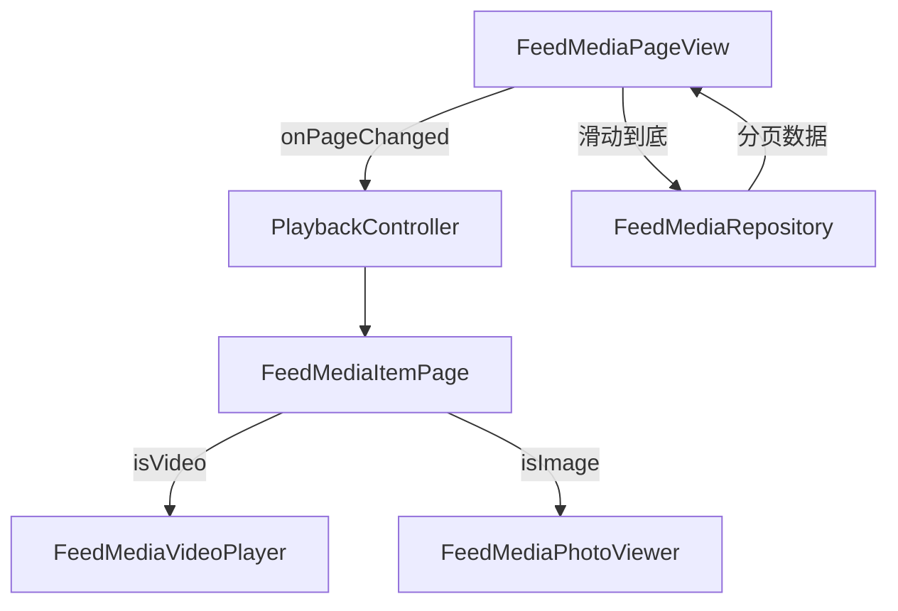

# 🛠️ Flutter FeedMedia 技术架构文档

## 一、整体技术栈

| 功能模块       | 技术选型                             |
|----------------|------------------------------------|
| 视频播放       | `better_player`                    |
| 图片浏览       | `photo_view` + `cached_network_image` + `PageView.builder` |
| 状态管理       | `Riverpod`                         |
| 页面切换       | `PageView.builder` + `PageController` |
| 数据加载       | 自定义分页加载 + 网络层封装         |
| 视频预加载（进阶） | 自定义预加载队列逻辑                 |
| 进度条         | 自定义 `Slider` 实现                 |

---

## 二、模块划分

### 1. FeedMediaPageView（滑动容器）
- 使用 `PageView.builder` 构建上下滑动流  
- 配合 `PageController` 监听滑动  
- 控制前后页保活与视频状态切换  
- 通过 `Riverpod` 管理媒体数据加载和页面状态  

### 2. FeedMediaItemPage（内容卡片）
- 作为单个媒体项的容器，判断内容类型为视频或图片  
- 分发至对应渲染器（`FeedMediaVideoPlayer` 或 `FeedMediaPhotoViewer`）  
- 管理视频播放器的交互（单击播放/暂停，长按功能弹窗）  
- 管理视频进度条的显示和更新  

### 3. FeedMediaVideoPlayer
- 封装 `better_player`，不显示默认控件  
- 接收 `isActive` 控制播放状态  
- 生命周期内销毁 / 重建播放器资源  
- 暴露 `BetterPlayerController` 供外部监听和控制  

### 4. FeedMediaPhotoViewer
- 使用 `photo_view` 展示单张图片，并结合 `PageView.builder` 实现多图左右滑动  
- 搭配 `cached_network_image` 进行本地缓存  
- 禁用手势放大缩小  

### 5. PlaybackController
- 提供全局播放状态管理：当前播放索引  
- 由 PageView 通知当前播放页索引  

### 6. FeedMediaRepository
- 管理网络请求，返回分页内容列表  
- 封装 APIClient 支持分页 & 错误处理  
- 提供模拟数据，包含 `id`, `type`, `url`, `coverUrl`, `title`, `description`, `topics`, `imageUrls` 等字段  

---

## 三、数据流架构



---

## 四、性能优化

- 使用 `AutomaticKeepAliveClientMixin` 保留页面状态  
- 控制同时播放视频数 ≤ 1（只播放当前页）  
- 销毁非当前页播放器，释放资源  
- 预加载前后两页（进阶）  
- 图片开启缓存，支持占位图与加载失败重试  
- **自定义进度条**: 使用 Flutter `Slider` 结合 `better_player` 的事件监听，避免了对 `better_player` 内部组件的依赖，提供了更灵活的UI控制和性能优化空间。  

---

## 五、Native 能力扩展（可选）

| 功能         | 实现方式                        |
|--------------|--------------------------------|
| 自定义播放器引擎 | Flutter ↔ Native `ijkPlayer`     |
| 后台播放     | iOS / Android 平台能力集成        |
| GPU 滤镜效果 | Flutter Texture + 原生编解码       |

---

## 六、异常处理

- 视频播放失败：展示封面 & 提示  
- 网络错误：展示重试按钮  
- 滑动中断：捕获边界索引或网络未加载逻辑  

---

## 七、依赖包

```yaml
dependencies:
  flutter:
    sdk: flutter
  better_player: ^0.0.85
  photo_view: ^0.14.0
  cached_network_image: ^3.3.1
  flutter_riverpod: ^2.5.1
```

---

## 八、平台兼容性

| 模块     | Android | iOS |
|----------|---------|-----|
| 视频播放 | ✅       | ✅   |
| 图片浏览 | ✅       | ✅   |
| 滑动容器 | ✅       | ✅   |
| 状态管理 | ✅       | ✅   |