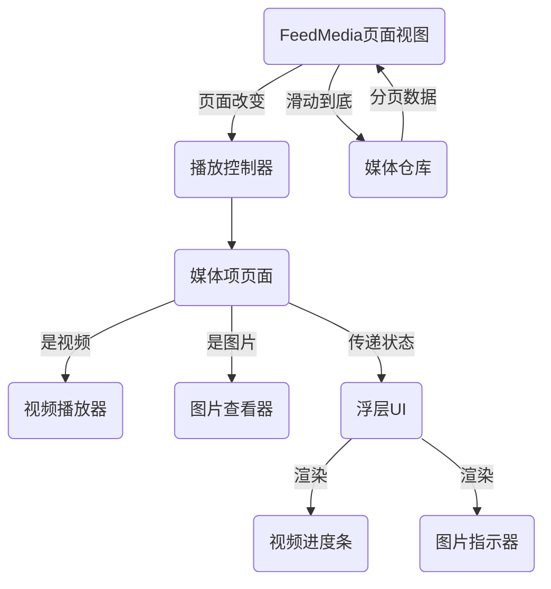

# GEMINI.md - Flutter FeedMedia 工程指导文档

本文档旨在为 Flutter FeedMedia 项目中的组件开发提供工程指导。它概述了项目的核心功能、技术架构、约定和优化策略，以确保开发过程的一致性、高质量和高性能。

## 1. 项目概述

Flutter FeedMedia 项目旨在构建一个高度沉浸式、可滚动的媒体流（视频/图片）组件，类似于主流内容平台。它优先考虑流畅的用户体验、高效的资源管理和可扩展性。

## 2. 核心功能

-   **可滚动内容流**: 视频和图片内容的无缝垂直滚动。
-   **视频播放**: 可见时自动播放，滑出时自动暂停，**全屏点击区域触发播放/暂停，暂停时显示播放/暂停图标，播放时隐藏**，长按功能弹窗，明确的资源释放。
-   **图片显示**: 支持视频/图片混合流，支持多张图片左右滑动切换，**并带有平滑动画的指示器**，不支持手势放大缩小。
-   **懒加载**: 到达流末尾时自动分页和数据加载。
-   **交互占位符**: 预定义点赞、评论、分享功能的区域，已实现UI占位符。
-   **信息展示**: 视频标题、描述、可点击的话题/关联内容。
-   **音频指示器**: 视频播放时的音量指示器。
-   **进度条**: 底部进度条，暂停时常显，播放时隐藏，**支持手势拖动修改进度，拖动时高度增加，手势结束恢复正常高度**。
-   **错误处理**: 优雅地处理网络和加载失败。
-   **长按功能**: **长按图片和视频都会触发不同的操作弹窗，并根据媒体类型显示不同的菜单。**

## 3. 技术栈与约定

### 3.1 核心技术

| 模块           | 技术/库                               | 说明                                                              |
| :--------------- | :----------------------------------------------- | :----------------------------------------------------------------- |
| 视频播放       | `better_player`                                  | `better_player` 更适合高级功能，已禁用默认UI。
| 图片显示       | `photo_view` + `cached_network_image` + `carousel_slider` + `dots_indicator` | `cached_network_image` 用于缓存，`photo_view` 用于展示单张图片，`carousel_slider` 用于多图滑动，`dots_indicator` 用于动画指示器。
| 状态管理       | `Riverpod`                                       | 使用 `Riverpod` 进行响应式和可测试的状态管理。                     |
| 页面切换       | `PageView.builder` + `PageController`            | 用于垂直滚动流。
| 数据加载       | 自定义分页逻辑 + 网络层封装         | 实现数据获取的清晰职责分离。                                       |
| 进度条         | `Slider`                                         | **使用 Flutter `Slider` 实现，结合 `better_player` 事件监听，并支持手势拖动修改进度。**
| UI 工具包       | Flutter                                          | 遵循 Flutter 的基于 Widget 的架构。

### 3.2 代码结构与命名

-   **模块化**: 组件应高度模块化和可重用。
-   **命名**: 遵循 Dart/Flutter 命名约定（例如，类使用 `CamelCase`，文件使用 `snake_case`）。
-   **Widget 层次结构**: 保持清晰和逻辑的 Widget 树。

## 4. 模块结构

项目围绕以下关键模块构建：

-   **`FeedMediaPageView`**: 主滚动容器 (`PageView.builder`)，管理页面过渡和状态，通过 `Riverpod` 管理媒体数据加载和页面状态。
-   **`FeedMediaItemPage`**: 一个通用内容卡片，**现在是媒体项的中央状态管理器，负责管理 `_currentImageIndex`，并将 `betterPlayerController` 和 `showProgressBar` 等状态传递给 `FeedMediaOverlayUI`。它还负责全屏点击手势的捕获。**
-   **`FeedMediaVideoPlayer`**: 封装 `better_player` 逻辑，根据 `isActive` 状态处理播放、暂停和资源管理，并暴露 `BetterPlayerController`。
-   **`FeedMediaPhotoViewer`**: **纯粹的、无状态的图片轮播组件，不再包含指示器逻辑，通过 `onPageChanged` 回调将页面索引传递给父组件。**
-   **`FeedMediaOverlayUI`**: **现在是所有底部浮层UI元素的统一管理中心，包括图片指示器和视频播放进度条。它接收来自 `FeedMediaItemPage` 的相关数据，并在内部进行布局。**
-   **`FeedMediaProgressBar`**: **其内部使用 `Slider` 实现手势拖动，并根据 `_isDragging` 状态动态调整 `trackHeight`。**
-   **`PlaybackController`**: 一个全局状态管理组件（通过 Riverpod），用于当前播放索引和整体播放状态。
-   **`FeedMediaRepository`**: 管理数据获取、分页和 API 交互，提供模拟数据。

## 5. 数据流



## 6. 性能与优化指南

-   **资源管理**:
    -   限制并发视频播放实例为单个（当前可见页面）。
    -   确保屏幕外项目的视频播放器资源明确销毁/释放。
    -   利用 `AutomaticKeepAliveClientMixin` 保持可见页面的状态。
-   **懒加载**: 实现高效的分页，仅在需要时加载内容。
-   **缓存**: 利用 `cached_network_image` 进行图片缓存。未来版本将包含视频缓存。
-   **自定义进度条**: 使用 Flutter `Slider` 结合 `better_player` 的 `addEventsListener` 来更新进度，提供了高度可定制的UI和更稳定的实现，避免了对 `better_player` 内部组件的依赖。**`Slider` 的 `onChanged` 回调仅更新视觉位置，`onChangeEnd` 回调才执行 `seekTo()` 操作，以实现流畅拖动。**
-   **布局抖动**: **`Visibility` Widget 的 `maintainSize`、`maintainAnimation` 和 `maintainState` 属性用于确保 Widget 在不可见时仍占据空间，从而消除布局抖动。**
-   **预加载（高级）**: 对于 V2.0+，实现相邻项目的视频预加载。
-   **流畅滚动**: 目标是 < 16ms 帧延迟。监控和优化 Widget 重建。

## 7. 质量保证与监控

-   **关键绩效指标 (KPIs)**:
    -   首屏加载时间: < 2s
    -   滚动响应: < 16ms 帧延迟
    -   播放器切换释放率: > 95%
    -   图片加载成功率: > 99%
-   **监控**:
    -   实现视频播放分析（加载时间、播放时间、错误率）。
    -   跟踪用户交互指标（滚动、点赞、评论）。
    -   集成崩溃报告和错误日志（例如，Sentry, Firebase Crashlytics）。

## 8. 依赖项

确保 `pubspec.yaml` 中包含并管理以下关键依赖项：

```yaml
dependencies:
  flutter:
    sdk: flutter
  better_player: ^0.0.84 # 或最新稳定版本
  photo_view: ^0.14.0 # 或最新稳定版本
  cached_network_image: ^3.3.1 # 或最新稳定版本
  flutter_riverpod: ^2.5.1 # 或最新稳定版本
  carousel_slider: ^latest_version # 用于多图滑动
  dots_indicator: ^latest_version # 用于动画指示器
```

## 9. 未来增强（路线图）

-   **V1.1 - 用户交互**: 点赞按钮动画、评论弹窗、静音切换、自动播放下一个。
-   **V1.2 - 播放器增强**: 封面图、加载动画、播放进度条、可选播放速度。
-   **V2.0 - 高性能与商业化**: 自定义预加载、“边播边下”、广告插入、弹幕集成、优化视频缓存。
-   **V2.1 - 多平台与原生**: 视频播放器支持 Web、`ijkPlayer` 集成、本地内容缓存与自动清理。
-   **V3.0+ - 长期演进**: 个性化推荐算法集成、内容创作/上传入口、国际化、暗黑模式 UI 支持、多流类型。

## 10. 编码规范与架构设计要点

### 10.1 编码规范

*   **Dart Linting**: 遵循 `analysis_options.yaml` 中定义的 Lint 规则，推荐使用 `flutter_lints` 或自定义严格的规则集，确保代码风格一致性。
*   **Widget 拆分**: 保持 Widget 的职责单一。大型 Widget 应拆分为更小、更可复用的无状态 (Stateless) 或有状态 (Stateful) 组件。避免在单个 Widget 中包含过多的业务逻辑或 UI 细节。
*   **文件与目录结构**: 采用清晰的模块化结构，例如：
    *   `lib/feed_media/`: 存放 FeedMedia 模块相关的所有代码（UI, 业务逻辑, 模型）。
*   **注释与文档**:
    *   所有公共类、方法、属性都应使用 Dart Doc 注释 (`///`) 进行文档说明，清晰描述其功能、参数和返回值。
    *   复杂逻辑或非显而易见的实现应添加行内注释 (`//`)。
*   **错误处理**:
    *   网络请求和异步操作应始终考虑错误处理，使用 `try-catch` 块捕获异常。
    *   Repository 层可以考虑返回 `Result` 类型（如 `Either<Failure, Success>`）来明确区分成功和失败状态，避免直接抛出异常。
*   **异步编程**: 熟练使用 `async/await` 处理异步操作，避免回调地狱。合理使用 `Future` 和 `Stream`。
*   **常量与枚举**: 重要的字符串、数字、路径等应定义为常量。使用枚举 (`enum`) 来表示有限的状态集。

### 10.2 迭代过程中的架构设计要点

*   **可扩展性**:
    *   **分层架构**: 严格遵循 UI (界面) -> Business Logic (业务逻辑，如 Providers/Notifiers) -> Data (数据，如 Repositories) 的分层，确保各层职责清晰，便于未来功能扩展和团队协作。
    *   **插件化/模块化**: 考虑将 FeedMedia 作为一个独立的 Flutter 模块或包，便于在其他项目中复用或独立迭代。
*   **可维护性**:
    *   **单一职责原则 (SRP)**: 每个类或函数只负责一项功能。
    *   **依赖倒置原则 (DIP)**: 高层模块不依赖低层模块的具体实现，而是依赖抽象。Riverpod 的 Provider 机制天然支持这一点。
    *   **代码审查**: 实施严格的代码审查流程，确保代码质量和规范遵循。
*   **可测试性**:
    *   **单元测试**: 对业务逻辑层 (Providers, Repositories) 进行充分的单元测试。
    *   **组件测试**: 对 UI 组件进行组件测试，确保 UI 渲染和交互符合预期。
    *   **集成测试**: 对关键用户流程进行集成测试，验证端到端的功能。
    *   **Mocking**: 善用 Mocking 框架（如 `mockito`）隔离依赖，提高测试效率。
*   **性能优化**:
    *   **持续监控**: 利用 Flutter DevTools 持续监控帧率、内存使用、CPU 占用，及时发现性能瓶颈。
    *   **懒加载与按需渲染**: 除了内容懒加载，UI 层面也应考虑按需渲染，例如使用 `Visibility` 或 `Offstage` 控制复杂组件的渲染时机。
    *   **图片与视频优化**: 确保图片资源大小合适，视频编码高效。
*   **平台特定能力集成**:
    *   对于需要原生能力扩展的功能（如 `ijkPlayer` 集成、后台播放），优先考虑使用 `platform_channels` 进行通信，并封装成 Dart 接口，保持 Flutter 层的纯净性。
    *   设计清晰的平台接口和实现，便于跨平台维护。
*   **状态管理演进**:
    *   Riverpod 是一个强大的选择，但随着项目复杂度的增加，可以探索其更高级的用法（如 `Family`, `AutoDispose`, `Notifier`）。
    *   对于非常复杂的全局状态，可以考虑结合 `GoRouter` 等路由库进行状态管理。
*   **依赖注入**:
    *   充分利用 Riverpod 的 Provider 机制进行依赖注入，管理服务、Repository 等实例的生命周期和共享。
*   **特性开关**:
    *   对于新功能或实验性功能，考虑引入特性开关机制，便于 A/B 测试、灰度发布和快速回滚。